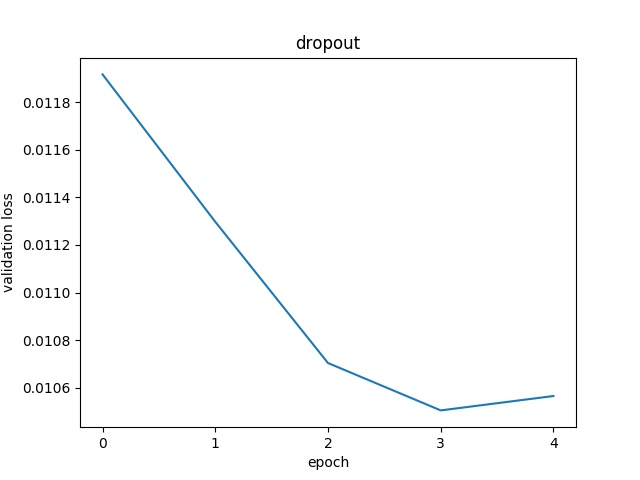
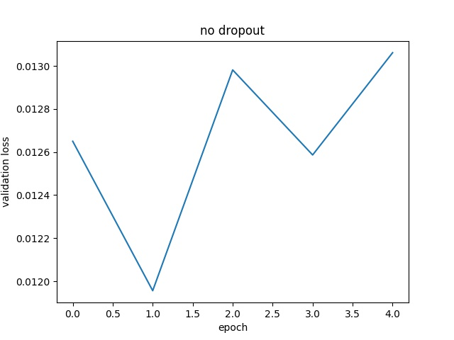

#**Behavioral Cloning**

##Writeup Template

###You can use this file as a template for your writeup if you want to submit it as a markdown file, but feel free to use some other method and submit a pdf if you prefer.

---

**Behavioral Cloning Project**

The goals / steps of this project are the following:
* Use the simulator to collect data of good driving behavior
* Build, a convolution neural network in Keras that predicts steering angles from images
* Train and validate the model with a training and validation set
* Test that the model successfully drives around track one without leaving the road
* Summarize the results with a written report


[//]: # (Image References)

[image1]: ./examples/placeholder.png "Model Visualization"
[image2]: ./examples/placeholder.png "Grayscaling"
[image3]: ./examples/placeholder_small.png "Recovery Image"
[image4]: ./examples/placeholder_small.png "Recovery Image"
[image5]: ./examples/placeholder_small.png "Recovery Image"
[image6]: ./examples/placeholder_small.png "Normal Image"
[image7]: ./examples/placeholder_small.png "Flipped Image"

## Rubric Points
###Here I will consider the [rubric points](https://review.udacity.com/#!/rubrics/432/view) individually and describe how I addressed each point in my implementation.  

---
###Files Submitted & Code Quality

####1. Submission includes all required files and can be used to run the simulator in autonomous mode

My project includes the following files:
* model.py containing the script to create and train the model
* drive.py for driving the car in autonomous mode
* model.h5.gz containing a trained convolution neural network.  The model was compressed to meet
github's size requirements. To decompress, run

    $gzip -d model.h5.gz
* writeup_report.md or writeup_report.pdf summarizing the results

####2. Submission includes functional code
Using the Udacity provided simulator and my drive.py file, the car can be driven autonomously around the track by executing
```sh
python drive.py model.h5
```

####3. Submission code is usable and readable

The model.py file contains the code for training and saving the convolution neural network. The file shows the pipeline I used for training and validating the model, and it contains comments to explain how the code works.

###Model Architecture and Training Strategy

####1. An appropriate model architecture has been employed

My model is based on the CNN used in NVIDIA's paper [End to End Learning for Self-Driving Cars](https://arxiv.org/pdf/1604.07316v1.pdf).
The model has 5 convolutions.  The first 3 convolutions use 5x5 filters, and the last 2, 3x3.  The final depth of
the convolution output is 64 layers.  The output is flattened and passed to a deep neural network containing 3
fully-connected layers.

The model includes RELU layers to introduce nonlinearity to the convolutional layers.  I experimented with linear, relu, and elu
activations on the fully-connected layers.  I found that simple linear activation yielded the best results.  

The data is normalized in the model using a Keras lambda layer.  The input is first converted to floating point values
between 0 and 1.  Then the input is converted from rgb to hsv color scheme.  The NVIDIA autonomous vehicle team used hsv
input for their model, so I did likewise.  Finally, the input is centered around 0 by subtracting .5.

####2. Attempts to reduce overfitting in the model

I experimented with dropout layers to reduce overfitting.  I used a dropout rate of .5 between the first 2 fully-connected layers
and a dropout rate of .2 between convolutional layers.  The appropriate dropout rates were determined from reading [this paper.](https://www.cs.toronto.edu/~hinton/absps/JMLRdropout.pdf)

The model was trained and validated on different data sets to ensure that the model was not overfitting. The model was tested by running it through the simulator and ensuring that the vehicle could stay on the track.

Validation loss rates were compared between networks with and without dropout layers.  The comparison suggests
that dropout did reduce overfitting.
 "Loass rates with dropout layers"

 "Loss rates without dropout layers"

####3. Model parameter tuning

The model used an adam optimizer. The Adam optimizer has a default learning rate of .001.  However, I got better results by
using a smaller learning rate.  The final model used a learning rate of .0001.

####4. Appropriate training data

Training data was chosen to keep the vehicle driving on the road. I used a combination of center lane driving,
recovering from the left and right sides of the road.

For details about how I created the training data, see the next section.

###Model Architecture and Training Strategy

####1. Solution Design Approach

The overall strategy for deriving a model architecture was to implement a convolutional neural network similar to previous
networks that have had success at similar tasks and train it on a representative data set.

My first step was to use a convolution neural network model similar to the NVIDIA autonomous vehicles team's model.
I thought this model might be appropriate because it had demonstrated good results at behavioral cloning on real roads.

In order to gauge how well the model was working, I split my image and steering angle data into a training and validation set. I found that my first model had a low mean squared error on the training set but a high mean squared error on the validation set. This implied that the model was overfitting.

To combat the overfitting, I introduced dropout layers into the model.  This yielded validation loss rates more inline with
expectations.

Then I collected data on the simple track.  I didn't want to collect too much meaningless data, so I limited initial data collection
to a single lap.  I went back later and collected data on the trickier parts of the track.

The final step was to run the simulator to see how well the car was driving around track one.
It did quite well.  [Here](https://youtu.be/q1nR-y2OIXY) is a link to the video.

There were a few turns where the outer wheel flirted with the yellow lane line.  
However, the car never went beyond the bounds of what I consider safe driving.

####2. Final Model Architecture

The final model architecture (model.py lines 36-54) consisted of a convolution neural network that
was almost identical to the network presented in
[the NVIDIA paper](https://www.cs.toronto.edu/~hinton/absps/JMLRdropout.pdf)

The main difference was the addition of dropout layers.

####3. Creation of the Training Set & Training Process

To capture good driving behavior, I first recorded one lap on track one using center lane driving.

I then recorded the vehicle recovering from the left side and right sides of the road back
to center so that the vehicle would learn to correct itself in the event that it got off course.

To augment the data sat, I flipped images horizontally.  I thought this would help balance
the model and make up for the fact that I had only driven the track in the counter-clockwise
direction.  I also incorporated multiple camera feeds in training the model.  I adjusted the
angles by .20 for cameras positioned to the right and left of the car.  This had the effect of
teaching the model about left and right of center driving.  Finally, I varied the brightness of the
training images.  The variation helped prevent overfitting and would theoretically improve performance
for morning and evening driving.

I finally randomly shuffled the data set and put 20% of the data into a validation set.

I used this training data for training the model. The validation set helped determine if the model was
over or under fitting. The ideal number of epochs was 4 as evidenced by the dropout loss graph from a
previous section. I used an adam optimizer with a slightly smaller learning rate than normal.
